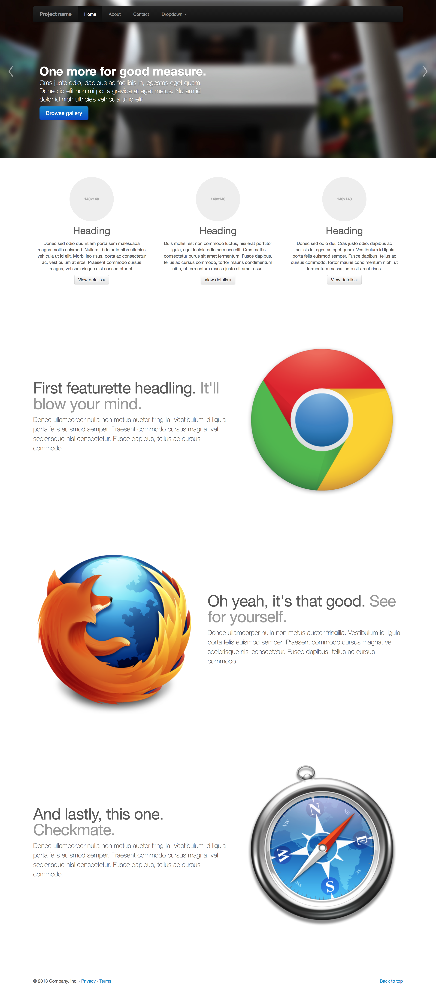

# Make a simple complete page via Bootstrap and CSS
## Business Requirements:

Implement the target page, write HTML code in the `index.html` file, write related CSS code in the style.css file.
Target Page：http://v2.bootcss.com/examples/carousel.html

Screenshot：


## Practice Challenges:
* Build a complete web page, including the layout and display style.
* Analyze the whole page structure clearly.
* Apply the Bootstrap Grid to complete the page layout.
* Apply Bootstrap navbar component to implement navigation bar.
* Apply Bootstrap thumbnail and img-circle components to implement content display like text , image etc.
* Apply Bootstrap carousel component to implement picture Rotation display.

## Practice Requirements:

* Only allow use HTML CSS and Bootstrap.
* Use Bootstrap component which are navbar,  thumbnail, img-circle and carousel.
* Use Bootstrap Grid to manage the main layout.
* The page style could be different, but the feature must be implemented.

## Practice Output:
Please push your practice repo to the site which the trainer will tell you.
The Repository should includes：
1. Implemented code
2. Screenshot after all code completed

## Environment Require
Chrome

## How to begin：

```
git clone `this repo site`
```
Stack Initial and build:

Open the index.html with browser directly, you will see the result of any change.

## Learning Resourse(Chinese Version):
1. CSS W3school教程：http://www.w3school.com.cn/css/index.asp
2. Bootstrap中文文档：http://www.bootcss.com/
3. CSS盒子模型（http://www.w3school.com.cn/css/css_boxmodel.asp）
4. 栅格系统（http://v3.bootcss.com/css/#grid）
什么是响应式设计（https://www.zhihu.com/question/20976405）
5. Bootstrap UI组件使用方法（http://v3.bootcss.com/components/）